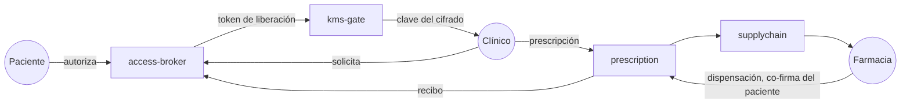
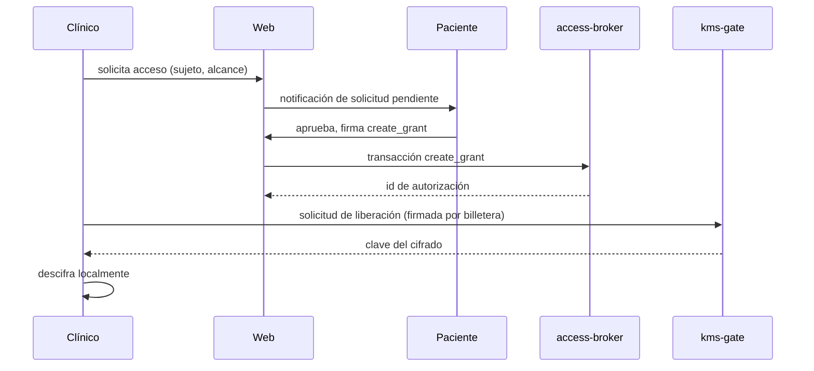

# Rappihistories

Historia clínica propiedad del paciente sobre Stellar.

Consentimiento. Auditoría. El puente entre el cuidado y su entrega.

Construido sobre Stellar / Soroban. El paciente primero. El predicado primero.

---
layout: statement
---

# El paciente es la única persona presente en cada encuentro.

Y la menos visible en el registro.

---
layout: section
---

# El problema

---
layout: statement
---

# Millones de personas viven con su información médica fragmentada.

Entre hospitales, ciudades, aseguradoras y países.

---

## La fragmentación tiene costo clínico

- Más hospitalizaciones.
- Mayores costos.
- Peores resultados clínicos.

Diversos estudios lo han documentado durante años.

La OMS viene impulsando la interoperabilidad y la continuidad del cuidado como pilares fundamentales de los sistemas de salud modernos.

---

## La movilidad global expone la fractura

Las personas se mueven entre ciudades, países y sistemas.

La información clínica se queda atrapada en sistemas que no se comunican entre sí.

En una emergencia, un médico puede no conocer:

- Alergias críticas.
- Medicamentos previos.
- Antecedentes vitales del paciente.

---

## Una historia por institución

- El laboratorio guarda sus resultados.
- El hospital guarda su epicrisis.
- La clínica guarda sus notas.
- La farmacia guarda sus dispensaciones.
- El paciente no guarda copia de nada.

Cada nuevo clínico es un arranque en frío.

---

## Lo que los pacientes preguntan

- "¿Dónde está mi resonancia?"
- "¿Mi última receta se despachó?"
- "¿Quién tiene acceso a mi historia ahora mismo?"
- "¿Puedo retirar ese acceso?"

Ninguna de estas preguntas tiene respuesta en una sola pantalla hoy.

---

## Lo que los clínicos preguntan

- La historia, no un hilo de fax.
- Una forma de escribir en la que el próximo clínico confíe.
- Medicamentos que existen y que la farmacia realmente tiene.
- Una firma que signifique algo legal el día de mañana.

Dos listas de lectura distintas. La misma vía faltante.

---
layout: section
---

# La tesis

---

## Nuestra propuesta

Construir una infraestructura **interoperable**, **segura**, y **centrada en el paciente**.

Donde el acceso clínico es verificable, sin comprometer la privacidad de la información médica.

---
layout: statement
---

# Simular la descentralización. Jamás simular el predicado.

---

## Qué significa

Las partes difíciles de la descentralización se pueden centralizar para un MVP.

KMS. Control administrativo. Emisión de credenciales. Custodia.

El **predicado de acceso** no se puede simular:

> Quién puede leer qué, cuándo, y por qué.

El predicado es la línea. Todo lo demás es comodidad operativa.

---

## El paciente como principal

En el contrato, el paciente no es "el sujeto de los datos".

El paciente es el **principal** que autoriza cada lectura, cada escritura,
cada dispensación. Su billetera es la firma.

El consentimiento es una transacción. No una casilla. No un formulario. No un fax.

---

## En cadena, fuera de cadena

**En cadena**

- Identidades (seudónimas)
- Autorizaciones de lectura y de escritura
- Compromisos (hashes del cifrado)
- Eventos de auditoría
- Estado de prescripción
- Reservas de cadena de suministro

**Fuera de cadena, cifrado**

- Notas clínicas
- Payloads de prescripción
- Recibos de dispensación
- Adjuntos e imagenología

La cadena coordina **quién está autorizado**.
El almacén guarda **qué está cifrado**.

---
layout: section
---

# La arquitectura

---

## El ciclo cerrado

Siete pasos. Tres actores. Una frontera de confianza.

---

## Tres roles, un único reglamento

| Rol | Lo que aporta | Lo que el contrato verifica |
| --- | --- | --- |
| Paciente | Billetera, decisiones de consentimiento | Sujeto de cada autorización |
| Clínico | Billetera, credencial profesional | Escribió bajo autorización vigente |
| Farmacia | Billetera, inventario | Dispensa solo al paciente nombrado |

La demo siembra tres billeteras de Testnet, una por rol. El mismo reglamento en Mainnet.

---

## Compromisos y localizadores

Cada evento clínico deja dos rastros en cadena:

- **Compromiso** — SHA-256 del payload cifrado.
- **Localizador** — un puntero al cifrado en el almacenamiento de objetos.

La cadena promete:

- Este localizador fue registrado por este principal en este momento.
- El cifrado en el localizador tiene este compromiso como hash.

Ningún dato clínico personal cruza la cadena.

---

## El portal KMS

El KMS es el único lugar que puede liberar una clave clínica.

Solo libera después de re-verificar el estado de la cadena.

Predicado de liberación, verificado en cada solicitud:

- La autorización existe.
- No está revocada.
- No tiene veto.
- El tiempo de revelación ya pasó.
- El tiempo de expiración no ha pasado.
- El solicitante es el principal nombrado en la autorización.

Las seis condiciones, cada vez.

---

## Revocar es un verbo de primera clase

- Cada autorización tiene un camino explícito de revocación.
- El paciente puede revocar desde su tablero en cualquier momento.
- Al desconectarse, la interfaz propone revocar antes de salir.
- La siguiente solicitud de acceso retorna `REVOKED`.

Solo hacia adelante: los bytes ya liberados no se pueden des-enviar. El diseño
es honesto sobre ese límite en vez de pretender que se puede revertir.

---
layout: section
---

# La demo

---

## Tres navegadores, tres billeteras

La demo corre en tres sesiones de navegador, cada una con una billetera
distinta de Stellar Testnet:

- **Navegador del paciente** — guarda la billetera del principal
- **Navegador del clínico** — guarda la billetera del médico
- **Navegador de la farmacia** — guarda la billetera de la farmacia

Cada rol ve un tablero distinto. Todos llegan a los mismos contratos.

---

## Tiempo uno — autorizar y leer

---

## Tiempo dos — prescribir y reservar

- El clínico compone la prescripción. Cifra localmente.
- Sube el cifrado. Envía el compromiso en cadena vía `prescription.issue`.
- Elige una farmacia del directorio sembrado.
- Reserva una unidad de inventario. La farmacia ve la reserva en tiempo real.

El paciente ve la prescripción en su tablero, atribuida al médico.

---

## Tiempo tres — dispensar

En la farmacia:

- La farmacia ve la reserva activa.
- El paciente se conecta, ve la dispensación pendiente.
- El paciente co-firma desde su billetera.
- La farmacia envía la dispensación — dos firmas, una transacción.
- El recibo se escribe en el access broker.

Soroban hace que el sobre de dos firmantes sea de primera clase. Sin relé fuera de cadena.

---

## Tiempo cuatro — revocar

- El paciente revoca la autorización de lectura desde su tablero.
- El próximo intento de lectura del clínico retorna `REVOKED`.
- El historial de lo leído permanece en el log de auditoría.
- Los bytes ya liberados no vuelven por arte de magia.

Honesto sobre el límite. Visible en el runbook.

---
layout: section
---

# Por qué Stellar

---

## Rápido. Barato. Finalidad suave.

- Cierre de ledger en unos cinco segundos.
- Sobre de tarifa en centavos por evento.
- Finalidad suave en el momento que la transacción se incluye.
- Un evento clínico ordinario es asequible de registrar en cadena.
- La auditoría deja de ser un reporte trimestral. Se vuelve un flujo.

---

## La autorización de Soroban facilita la firma múltiple

El paso de dispensación de la farmacia es una sola transacción con dos firmantes
requeridos — paciente y farmacia.

Soroban expone `require_auth(addr)` como primitiva de primera clase. El
contrato declara la regla; el runtime verifica las pruebas.

Sin relé de co-firma fuera de cadena. Sin servicio notarial. Solo la transacción.

---

## Auditabilidad sin vigilancia

- Cada autorización, revocación, solicitud, liberación, prescripción, reserva y
  dispensación es un evento en cadena.
- Los eventos no contienen datos clínicos personales. Contienen compromisos e identificadores de principales.
- Cualquiera puede verificar que la cadena es consistente.
- Nadie descubre qué fue tratado.

La auditoría y la privacidad dejan de pelear.

---
layout: section
---

# Qué centralizamos

---

## Honestos al respecto

| Pieza | Por qué centralizada para el MVP | Qué cuesta |
| --- | --- | --- |
| Portal KMS | Un servicio, sin malla de HSM | Confidencialidad solo hacia adelante |
| Emisión de identidad | Billeteras de rol sembradas | Aún no portable por el paciente |
| Almacenamiento | Cloudflare R2 | Superficie de un solo proveedor |
| Indexador | Un Postgres | Un solo dueño operacional |

Cada celda es un pasivo conocido. Ninguna debilita el predicado.

---

## El predicado se queda. Siempre.

El MVP corre en un solo KMS. Un despliegue real corre en un KMS real.

El MVP usa un solo indexador. Un despliegue real corre muchos.

Lo que **no** cambia:

- La autorización decide.
- La revocación decide.
- La cadena atestigua.
- El paciente es el principal.

---
layout: section
---

# Hoja de ruta

---

## Fases

| Fase | Lo que demuestra | Estado |
| --- | --- | --- |
| MVP local manual | Ciclo cerrado en stellar-local | En progreso |
| Stellar Testnet | El mismo ciclo, tres navegadores, público | Diseñado |
| KMS endurecido | Revocación de bytes y custodia HSM | Fuera de alcance |
| Identidad regulada | Credenciales verificables de clínico | Fuera de alcance |
| Mainnet | Datos clínicos propiedad del paciente, a escala | Largo plazo |

---

## Qué se necesita para ir real

- Un KMS regulado — Cloud KMS, HSM, o enclave sellado.
- Una autoridad de credenciales clínicas — afirmaciones verificables en cadena.
- Una historia de identidad del paciente — recuperación de billetera, delegación, fin de vida.
- Un SLA de almacenamiento — durabilidad, residencia regional, respuesta a brechas.
- Una historia de operaciones — monitoreo, paginación, revisión de incidentes.

El MVP los hace concretos. Ya no son teóricos.

---
layout: section
---

# Cierre

---

## Lo que hace esto distinto

- El paciente es el **principal**, no una firma en un formulario.
- El consentimiento es una **transacción**, no una casilla.
- La auditoría es un **log de eventos**, no un reporte trimestral.
- Revocar es un **verbo**, no un ticket de servicio al cliente.
- La prescripción es un **puente**, no una hoja impresa.

La dApp es la demo. La arquitectura es el artefacto.

---
layout: center
class: text-center
---

# Gracias

Construido sobre Stellar / Soroban.

El paciente primero. El predicado primero.
