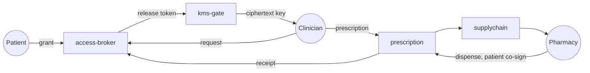

# Rappihistories

Patient-owned clinical history on Stellar.

A demo of consent, audit, and the bridge between care and care delivery.

---
layout: section
---

## The patient is the last to know.

---

## A clinical chart per institution

- Records live in clinics, labs, hospital chains, insurers.
- A new clinician means a new chart, a new gap, a new request.
- The patient is the only person present at every encounter.
- They have the least visibility into their own history.

The system already exists. It is just not under the patient's control.

---
layout: section
---

## Stub the decentralization. Never stub the predicate.

---

## What that means

The hard parts of decentralization can be centralized for an MVP — KMS,
admin control, credential issuance.

The **access predicate** cannot be stubbed.

> Who can read what, when, and why.

The predicate is the line. Everything else is operational comfort.

---

## The closed loop

Seven steps. Three actors. One trust boundary.

---

## Three roles, one rulebook

| Role | What they bring | What the contract checks |
| --- | --- | --- |
| Patient | Wallet, consent decisions | Subject of every grant |
| Clinician | Wallet, professional credential | Authored under a live grant |
| Pharmacy | Wallet, inventory | Dispenses only to the named patient |

The demo seeds three Testnet wallets, one per role. Same rulebook on Mainnet.

---

## Off-chain PHI, on-chain consent

**On chain**

- Identities
- Grants
- Commitments
- Audit events

**Off chain**

- Clinical notes
- Prescription payloads
- Dispense receipts
- Attachments

The chain coordinates **who is allowed**.
The store holds **what is encrypted**.

---

## Revoke is a first-class verb

- Every grant has an explicit revoke path.
- The patient can revoke from their dashboard at any time.
- On disconnect, the UI prompts the patient to revoke before leaving.
- The next access request returns `REVOKED`.

Forward-only: bytes already released cannot be unsent. The design is
honest about that limit instead of pretending it can be reversed.

---

## The demo, in seven beats

1. Patient opens the dashboard. Doctor opens the dashboard.
2. Doctor requests access. Patient sees it. Patient grants.
3. KMS releases. Doctor decrypts. Doctor reads.
4. Doctor prescribes. Pharmacy is selected. A unit is reserved.
5. Patient arrives at the pharmacy. Both connect.
6. Patient co-signs the dispense. The receipt is written on chain.
7. Patient revokes. The doctor's next request is rejected.

---

## What Stellar gives us

- A shared notary for consent and audit.
- Cheap, fast transactions — clinical events don't need a backbone block reward.
- Soroban auth — multi-party signing is a first-class operation.
- A small attack surface — the contract stores commitments, not content.
- A demoable testnet — the same path that runs locally runs publicly.

---

## Roadmap

| Phase | What is proven | Status |
| --- | --- | --- |
| Local manual MVP | Closed loop on stellar-local | In progress |
| Stellar Testnet | Same loop, two browsers, public | Designed |
| Beyond | Real KMS, regulated identity, production PHI | Out of scope |

---

## What makes this different

- Patient is the **principal**, not a signature on a form.
- Consent is a **transaction**, not a checkbox.
- Audit is an **event log**, not a quarterly report.
- Revoke is a **verb**, not a customer-service ticket.

---
layout: center
class: text-center
---

# Thank you

Built on Stellar / Soroban.
Patient first. Predicate first.
