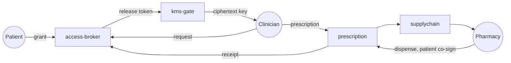
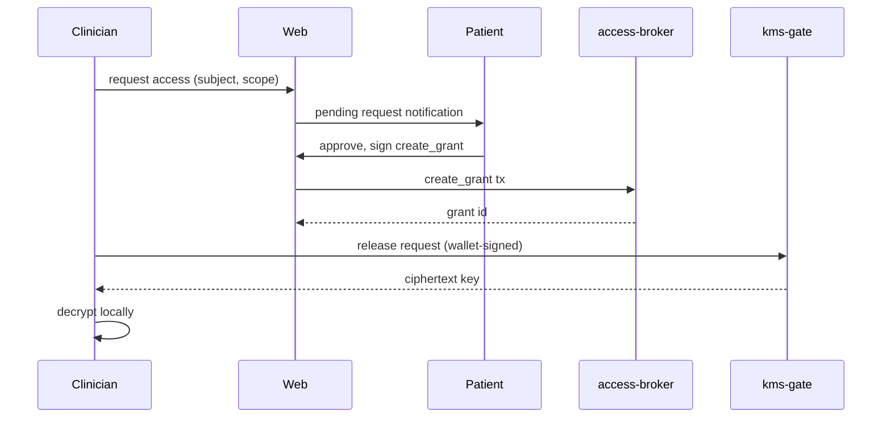

# Rappihistories

Patient-owned clinical history on Stellar.

Consent. Audit. The bridge between care and care delivery.

Built on Stellar / Soroban. Patient first. Predicate first.

---
layout: statement
---

# The patient is the only person present at every encounter.

And the least visible in the record.

---
layout: section
---

# The problem

---

## A chart per institution

- The lab keeps its results.
- The hospital keeps its discharge summary.
- The clinic keeps its notes.
- The pharmacy keeps its dispenses.
- The patient keeps a copy of nothing.

Every new clinician is a cold start.

---

## What patients ask for

- "Where is my MRI?"
- "Did my last prescription get filled?"
- "Who has access to my history right now?"
- "Can I take that access back?"

None of these questions have a one-screen answer today.

---

## What clinicians ask for

- The history, not a fax thread.
- A way to write that the next clinician will trust.
- Drugs that exist and that the pharmacy actually has.
- A signature that means something legally tomorrow.

Two different reading lists. Same missing rail.

---
layout: section
---

# The thesis

---
layout: statement
---

# Stub the decentralization. Never stub the predicate.

---

## What that means

The hard parts of decentralization can be centralized for an MVP.

KMS. Admin control. Credential issuance. Custody.

The **access predicate** cannot be stubbed:

> Who can read what, when, and why.

The predicate is the line. Everything else is operational comfort.

---

## Patient as principal

In the contract, the patient is not "the data subject."

The patient is the **principal** who authorizes every read, every write,
every dispense. Their wallet is the signature.

Consent is a transaction. Not a checkbox. Not a form. Not a fax.

---

## On chain, off chain

**On chain**

- Identities (pseudonymous)
- Grants and write grants
- Commitments (ciphertext hashes)
- Audit events
- Prescription state
- Supply-chain reservations

**Off chain, encrypted**

- Clinical notes
- Prescription payloads
- Dispense receipts
- Attachments and imaging

The chain coordinates **who is allowed**.
The store holds **what is encrypted**.

---
layout: section
---

# The architecture

---

## The closed loop

Seven steps. Three actors. One trust boundary.

---

## Three roles, one rulebook

| Role | What they bring | What the contract checks |
| --- | --- | --- |
| Patient | Wallet, consent decisions | Subject of every grant |
| Clinician | Wallet, professional credential | Authored under a live grant |
| Pharmacy | Wallet, inventory | Dispenses only to the named patient |

The demo seeds three Testnet wallets, one per role. Same rulebook on Mainnet.

---

## Commitments and locators

Every clinical event leaves two on-chain traces:

- **Commitment** — SHA-256 of the encrypted payload.
- **Locator** — a pointer to the ciphertext in object storage.

The chain promises:

- This locator was registered by this principal at this time.
- The ciphertext at the locator hashes to this commitment.

No PHI ever crosses the chain.

---

## The KMS gate

The KMS is the only place that can release a clinical key.

It releases only after re-verifying the chain state itself.

Release predicate, checked on every request:

- The grant exists.
- It is not revoked.
- It is not vetoed.
- Reveal time has passed.
- Expiry time has not.
- The requester is the principal named in the grant.

All six conditions, every time.

---

## Revoke is a first-class verb

- Every grant has an explicit revoke path.
- The patient can revoke from their dashboard at any time.
- On disconnect, the UI prompts revoke before leaving.
- The next access request returns `REVOKED`.

Forward-only: bytes already released cannot be unsent. The design is
honest about that limit instead of pretending it can be reversed.

---
layout: section
---

# The demo

---

## Three browsers, three wallets

The demo runs across three browser sessions, each with a different
Stellar Testnet wallet:

- **Patient browser** — holds the principal wallet
- **Clinician browser** — holds the doctor wallet
- **Pharmacy browser** — holds the pharmacy wallet

Each role sees a different dashboard. They all hit the same contracts.

---

## Beat one — grant and read

---

## Beat two — prescribe and reserve

- Clinician composes the prescription. Encrypts locally.
- Uploads ciphertext. Submits the commitment on chain via `prescription.issue`.
- Selects a pharmacy from the seeded directory.
- Reserves an inventory unit. The pharmacy sees the reservation in real time.

The patient sees the prescription in their dashboard, attributed to the doctor.

---

## Beat three — dispense

At the pharmacy:

- Pharmacy sees the active reservation.
- Patient connects, sees the pending dispense.
- Patient co-signs from their wallet.
- Pharmacy submits the dispense — two signatures, one transaction.
- Receipt is written to the access broker.

Soroban makes the two-signer envelope first-class. No off-chain relay.

---

## Beat four — revoke

- Patient revokes the read grant from their dashboard.
- The clinician's next read attempt returns `REVOKED`.
- The history of what was read remains in the audit log.
- The bytes that were already released are not magic-returned.

Honest about the limit. Visible in the runbook.

---
layout: section
---

# Why Stellar

---

## Fast. Cheap. Soft-final.

- About a five-second ledger close.
- Cents-per-event fee envelope.
- Soft finality the moment a tx is included.
- An ordinary clinical event is affordable to log on chain.
- Audit is no longer a quarterly report. It is a stream.

---

## Soroban auth makes multi-party signing easy

The pharmacy dispense step is a single transaction with two required signers
— patient and pharmacy.

Soroban exposes `require_auth(addr)` as a first-class primitive. The
contract states the rule; the runtime checks the proofs.

No off-chain co-sign relay. No notary service. Just the transaction.

---

## Auditability without surveillance

- Every grant, revoke, request, release, prescription, reservation, and
  dispense is an event on chain.
- The events do not contain PHI. They contain commitments and principal
  identifiers.
- Anyone can verify the chain is consistent.
- Nobody learns what was treated.

Audit and privacy stop fighting.

---
layout: section
---

# What we centralized

---

## Honest about it

| Piece | Why centralized for MVP | What that costs |
| --- | --- | --- |
| KMS gate | One service, no HSM mesh | Forward-only secrecy |
| Identity issuance | Seeded role wallets | Not patient-portable yet |
| Storage | Cloudflare R2 | Single-vendor surface |
| Indexer | One Postgres | One operational owner |

Each cell is a known liability. None of them weakens the predicate.

---

## The predicate stays. Always.

The MVP runs on a single KMS. A real deployment runs on real KMS.

The MVP uses one indexer. A real deployment runs many.

What does **not** change:

- The grant decides.
- The revoke decides.
- The chain witnesses.
- The patient is the principal.

---
layout: section
---

# Roadmap

---

## Phases

| Phase | What is proven | Status |
| --- | --- | --- |
| Local manual MVP | Closed loop on stellar-local | In progress |
| Stellar Testnet | Same loop, three browsers, public | Designed |
| Hardened KMS | Bytes-revoke and HSM custody | Out of scope |
| Regulated identity | Verifiable clinician credentials | Out of scope |
| Mainnet | Patient-owned PHI at scale | Long-term |

---

## What it takes to go real

- A regulated KMS — Cloud KMS, HSM, or sealed enclave.
- A clinician credential authority — verifiable claims on chain.
- A patient identity story — wallet recovery, delegation, end of life.
- A storage SLA — durability, regional residency, breach response.
- An ops story — monitoring, paging, incident review.

The MVP makes these concrete. They are not theoretical anymore.

---
layout: section
---

# Closing

---

## What makes this different

- Patient is the **principal**, not a signature on a form.
- Consent is a **transaction**, not a checkbox.
- Audit is an **event log**, not a quarterly report.
- Revoke is a **verb**, not a customer-service ticket.
- The prescription is a **bridge**, not a printed sheet.

The dApp is the demo. The architecture is the artifact.

---
layout: center
class: text-center
---

# Thank you

Built on Stellar / Soroban.

Patient first. Predicate first.
